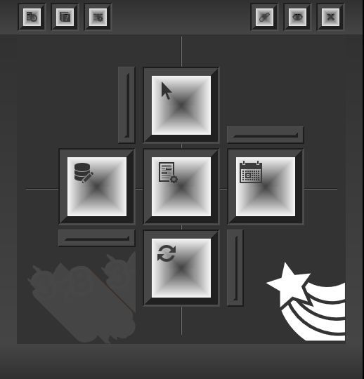
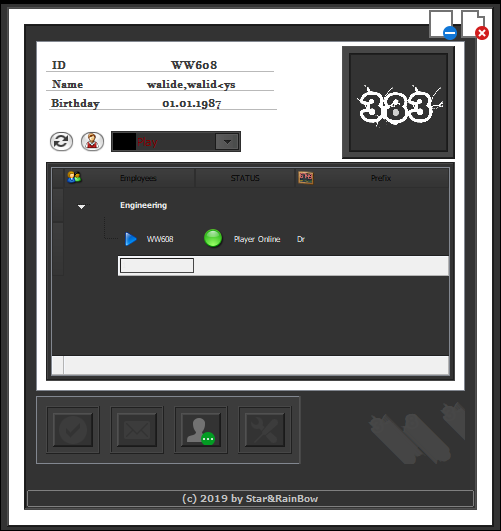
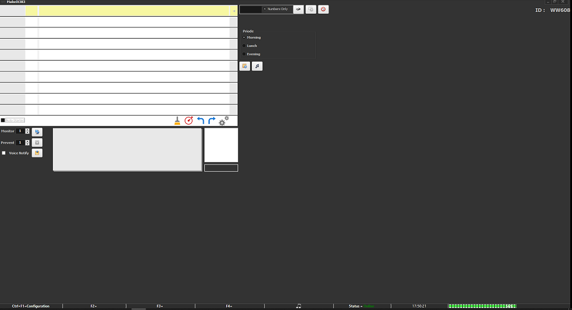

# 383
`383` is task management and collaboration Software designed to keep your team's task lists in context with the rest of your project assets.

**Authors:**  *WalWalWalides*
------

`383` help employees to take control of their daily work, in areas from marketing to employee onboarding and customer service to finance and human resources.

Principal Software Benefits:

      - To-Do List View.

      - Time Tracking.

      - To-Do List View.

    
### Online View

### To-Do List View

------

