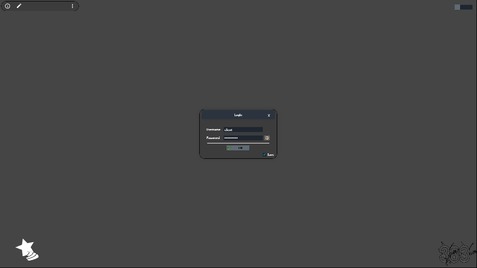
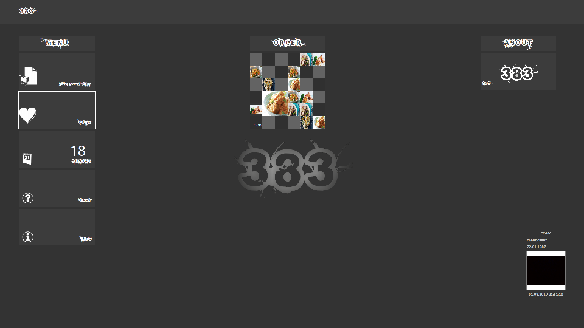
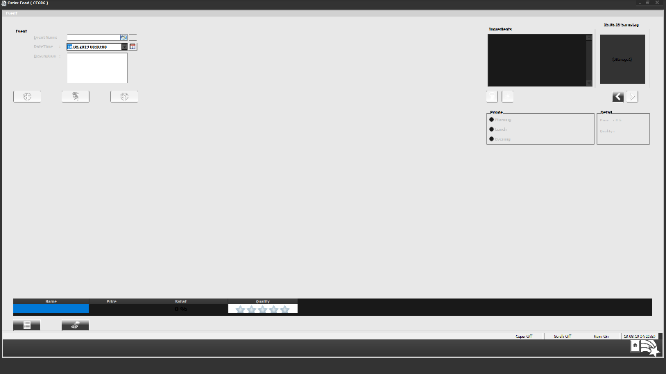
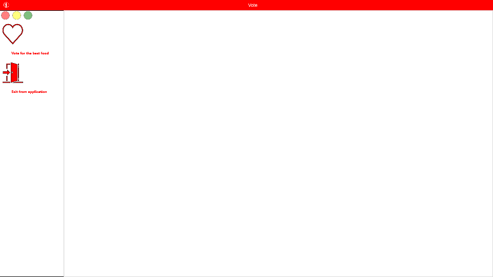

# GO383
GO383 is the Software Solution for Restaurants with features such as Employee Management, Task Management, Customer Management and Digital Marketing.

**Authors:**  *WalWalWalides*
------

GO383 enables you to produce only what is on order, prioritize sales and production orders for production line control, and shorten response time to production. 

Principal Software Benefits:

      - Match sales orders directly to customer orders.
      - Ensure production line control and prioritize sales & production orders.
      - Review and archive customer details. 
      - Handling all business operations from a single place.
      - Manage orders at every step.
      - Fast and accurate order management.
      
### Menu     

### Order Online System

### Online Voting System

      

    

