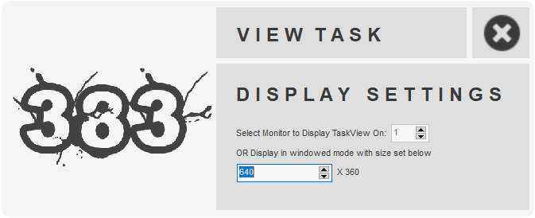
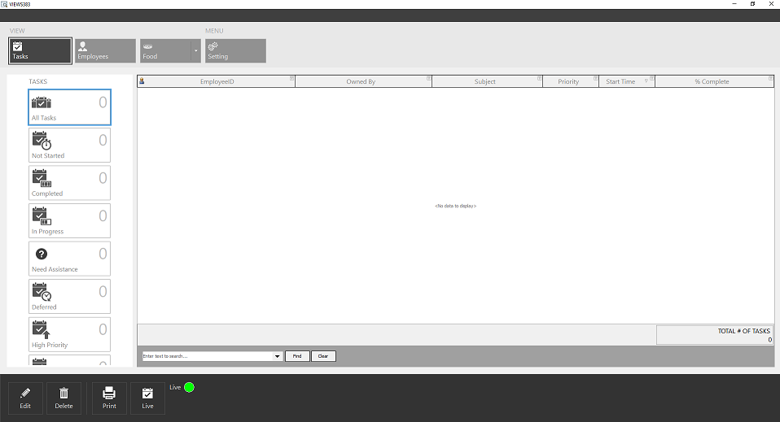
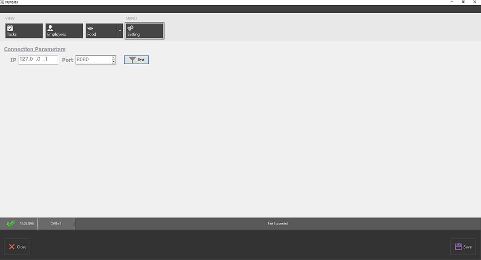

# VT383
`VT383` helps you organize tasks, prioritize them and keep track of different tasks that are pending. 

**Authors:**  *WalWalWalides*
------

`VT383` is innovative features like Time tracking,Project reporting . 
 Your tasks's planning , testing,tracking and reporting all are done at the same place.

Principal Software Benefits:

      - Flexible and powerful resource cost planning and tracking.

      - Efficient project and resource planning, master plans.

      - Strong resource management and capacity planning.

    

------
### View Tasks (Live Mode)

### Setting Connection

