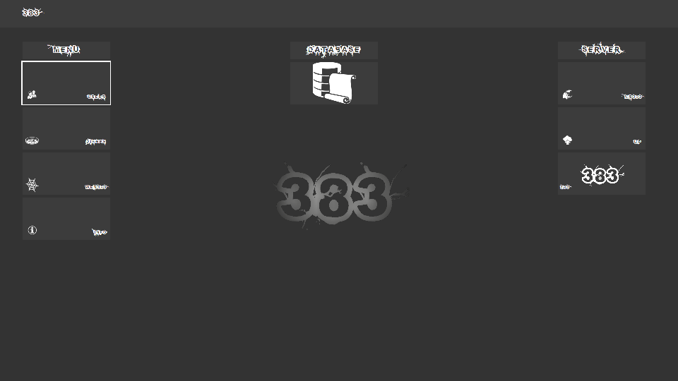
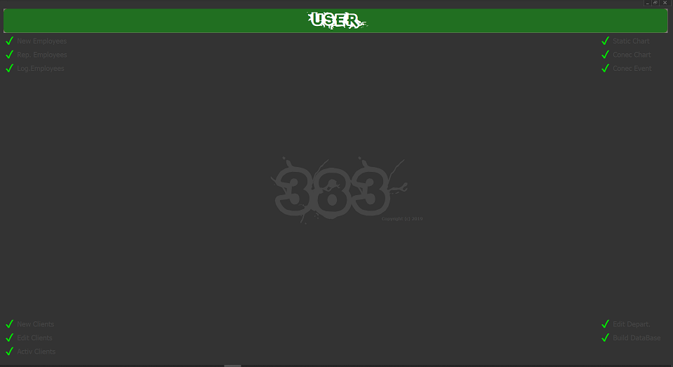
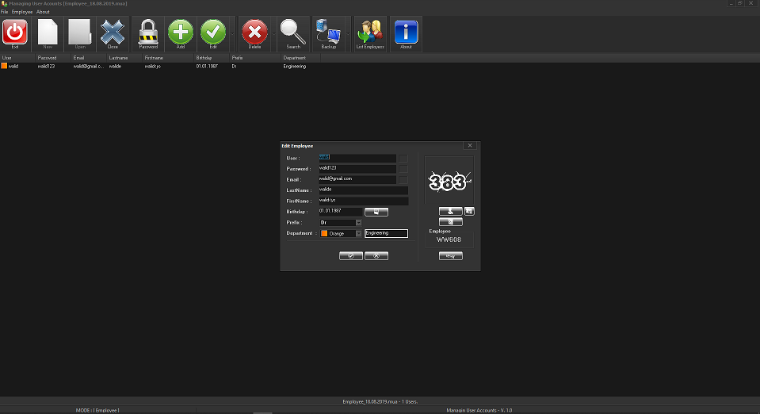
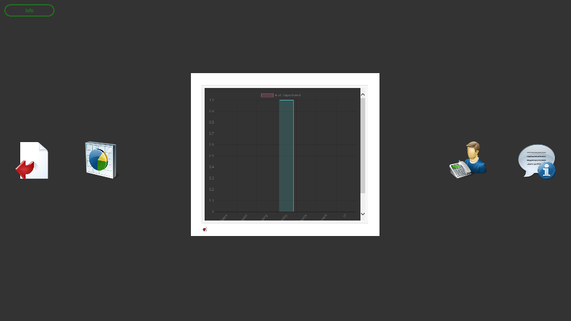

# MMS383
`MMS383` is a Server Management and Monotoring Software, an essential Tool for System Administrators,as it allows for Automated Reporting,scheduled Checks ,pre-emptive warnings and change Communication Settings.

**Authors:**  *WalWalWalides*
------

The software offers a new way for better collaboration, communication and identification. That means granting increased productivity - that promises more and better work in less time.
`MMS383` simplifies service planning and organization, enables optimal staffing, improves service quality, simplifies documentation, and ultimately increases the security of every transaction.

Principal Software Benefits:

      - Managing any size and type of restaurant,.

      - Handling every aspect of your restaurant operations.

      - Strong resource management and capacity planning.

      - Feedback management.
      
      - Access Data anytime, anywhere. 
      
      
 ### Menu
     

 ### Select, Insert, Update, Delete Employees

 ### View Department

    

